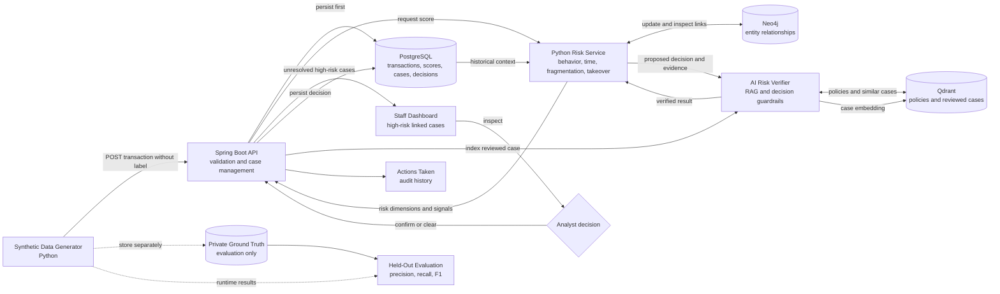

# RiskLens — AI-Powered Abuse-Ring Sentinel

RiskLens is a defense-only payment-risk prototype that detects coordinated abuse
hidden across multiple accounts, devices, IP addresses, payment instruments, and
beneficiaries. It combines deterministic behavioral scoring, temporal analysis,
relationship graphs, retrieval-augmented verification, and human review in one
auditable workflow.

> Built for Track 02 — AI Risk Manager: detect one class of financial loss and
> measure it honestly with precision, recall, and false-positive cost.

## The problem

A fraudulent payment is not always large or individually unusual. A coordinated
group can split money into several normal-looking payments and distribute its
activity across different accounts:

```text
Account A ── ₹5,000 ──┐
Account B ── ₹7,500 ──┤
Account C ── ₹6,800 ──┼──> Beneficiary X
Account D ── ₹8,000 ──┤
Account E ── ₹7,200 ──┘

Shared devices + shared IPs + short time window = possible abuse ring
```

Transaction-by-transaction rules can miss this wider pattern. RiskLens evaluates
the payment, its recent history, and its relationships before sending only
verified high-risk linked cases to an analyst.

## What RiskLens does

- Generates realistic normal and defense-only synthetic payment scenarios.
- Validates and persists every transaction through a Spring Boot gateway.
- Scores transaction, account, behavior, velocity, fragmentation, takeover, and
  relationship risk in Python.
- Builds an entity graph in Neo4j to reveal coordinated activity.
- Retrieves applicable policies and similar reviewed cases from Qdrant.
- Shows only unresolved high-risk linked cases on a staff dashboard.
- Records analyst decisions and automatically reuses reviewed cases as future
  retrieval evidence.
- Evaluates predictions against labels that remain outside the runtime path.

## System architecture



The verifier is a second-stage evidence layer—not the primary fraud detector.
The deterministic risk engine decides what is abnormal; RAG supplies relevant
policies and historical context so the result is explainable.

## Technology stack

| Layer | Technology | Responsibility |
|---|---|---|
| Payment boundary | Java 17, Spring Boot | Validation, persistence, risk orchestration, case APIs |
| Risk intelligence | Python, FastAPI | Behavioral, temporal, account, transaction, and graph scoring |
| Evidence verifier | Python, FastAPI, RAG | Policy retrieval, similar-case retrieval, decision guardrails |
| Transaction store | PostgreSQL 16 | Transactions, scores, cases, signals, analyst decisions |
| Relationship store | Neo4j 5 | Accounts, devices, IPs, instruments, beneficiaries, payments |
| Vector memory | Qdrant | Fraud-policy and reviewed-case embeddings |
| Staff interface | React, TypeScript, Next.js-compatible Vite runtime | Investigation queue, inspection, analyst actions |
| Runtime | Docker Compose | Local multi-service orchestration |

## Verified prototype results

The final full regression used a fresh held-out synthetic set of 300 payments:
240 normal and 60 abusive. Ground-truth labels were never sent to the runtime
services.

| Metric | Result |
|---|---:|
| Ingestion and scoring coverage | 300 / 300 |
| Precision | 100% |
| Recall | 56.7% |
| F1 score | 72.3% |
| False positives | 0 |
| Account-takeover recall | 4 / 4 |
| Velocity-burst recall | 8 / 17 |
| Unavailable risk results | 0 |

These are prototype results on synthetic data, not production-performance
claims. The system is intentionally conservative: its high precision keeps the
analyst queue clean, while the remaining false negatives identify clear work
for future scoring improvements.

The detailed evidence is available in
[`evaluation/reports/application-hardening-final.md`](evaluation/reports/application-hardening-final.md).

## Quick start

### Requirements

- Docker Engine 24+
- Docker Compose v2
- GNU Make
- `curl`

### Start the complete application

```bash
git clone https://github.com/Brahma-Agni/razorpay-ai.git
cd razorpay-ai
make setup
make stack-up
make stack-check
```

The committed defaults bind all services to `127.0.0.1`. On a fresh clone, open:

| Service | URL |
|---|---|
| Staff dashboard | <http://localhost:3000> |
| Actions Taken | <http://localhost:3000/actions> |
| Spring Boot health | <http://localhost:8080/actuator/health> |
| Risk-service API docs | <http://localhost:8000/docs> |
| Verifier API docs | <http://localhost:8090/docs> |
| Neo4j Browser | <http://localhost:7474> |
| Qdrant dashboard | <http://localhost:6333/dashboard> |

Ports are configurable in `.env`. If you already have a local `.env`, use the
ports defined there instead of the defaults above.

Local Neo4j credentials:

```text
Username: neo4j
Password: risklens_dev_password
```

Local PostgreSQL credentials:

```text
Host: localhost
Port: 5432
Database: risklens
Username: risklens
Password: risklens_dev_password
```

These credentials are for loopback-only development. Replace every default
secret before using a shared environment.

## Run the demonstration

Generate a deterministic payment dataset and stream it through the full system:

```bash
make data-generate
make data-stream
```

Then open the dashboard. Normal and low-risk payments are stored but deliberately
excluded from the investigation queue. Use **Inspect** on a high-risk case to see
its linked transactions, risk signals, and retrieved evidence. After choosing
**Confirm Fraud** or **False Positive**, the case moves to **Actions Taken** and
its reviewed-case embedding is written to Qdrant.

Run the offline evaluation after streaming:

```bash
make evaluate
```

Generated reports are written to `evaluation/reports/`.

## Useful commands

```bash
make stack-up          # build and start the complete stack
make stack-check       # verify application health
make stack-down        # stop services and preserve database volumes
make data-generate     # create transactions and private evaluation labels
make data-stream       # submit generated transactions to Spring Boot
make evaluate          # calculate held-out metrics
make backend-test      # run Spring Boot tests
make risk-test         # run risk-service tests
make verifier-test     # run verifier tests
make data-test         # run generator tests
make evaluation-test   # run evaluator tests
```

`make infra-reset` deletes the local database volumes. Use it only when you
intentionally want a clean dataset.

## API flow

The browser and generator communicate only with Spring Boot. They never connect
directly to the databases or Python services.

```text
POST /api/v1/transactions
    → validate and store transaction
    → call risk service
    → calculate behavioral, temporal, graph, and similarity risk
    → verify evidence against policies and reviewed cases
    → persist scores and create a case when required

GET  /api/v1/risk-cases/high-risk-linked
    → return unresolved linked cases for the staff dashboard

POST /api/v1/risk-cases/{caseId}/decision
    → resolve the case
    → store the audit record
    → index the reviewed case in Qdrant

GET  /api/v1/analyst-actions
    → return resolved cases for Actions Taken
```

Interactive contracts are available at the risk service and verifier `/docs`
URLs after startup. The Spring Boot endpoint details are documented in
[`backend/README.md`](backend/README.md).

## Repository structure

```text
razorpay-ai/
├── backend/                 # Spring Boot gateway and case management
├── data-generator/          # Synthetic ecosystem and labeled scenarios
├── risk-service/            # Behavioral, temporal, graph, and similarity scoring
├── ai-risk-verifier/        # RAG retrieval and evidence guardrails
├── frontend-dashboard/      # Staff investigation dashboard
├── evaluation/              # Held-out metrics and threshold analysis
├── database/
│   ├── postgres/init/       # Transactional schema and seed data
│   ├── neo4j/init/          # Graph constraints
│   └── qdrant/init/         # Vector collections
├── shared/schemas/          # Language-neutral service contracts
├── docker-compose.yml
├── Makefile
└── .env.example
```

The `shared/` directory is not a deployed service. It defines the JSON contracts
that keep Java, Python, and TypeScript payloads aligned.

## Research foundation

- [Spatio-Temporal Directed Graph Learning for Account Takeover Fraud Detection
  (ATLAS, 2025)](https://arxiv.org/abs/2509.20339) motivates time-respecting
  relationships between accounts, devices, and IP addresses.
- [Advanced Real-Time Fraud Detection Using RAG-Based LLMs
  (2025)](https://arxiv.org/abs/2501.15290) informs the adaptable policy-retrieval
  mechanism. That paper focuses on call fraud; RiskLens applies the retrieval
  pattern to payment-risk verification rather than claiming a direct reproduction.

## Safety and evaluation integrity

- RiskLens is strictly defensive: it detects, explains, verifies, and records.
- Synthetic ground truth is written to a separate evaluation file and excluded
  from backend payloads, PostgreSQL runtime schemas, Neo4j, Qdrant, and prompts.
- Analyst decisions remain human-controlled; the AI provides evidence and a
  recommendation rather than making an irreversible financial decision.
- Failed required verification does not silently produce an automated allow.

## Current limitations

- The dataset and reported metrics are synthetic.
- Recall is still limited for early events that occur before enough relationship
  or time-window evidence has accumulated.
- The current hashing embeddings demonstrate the RAG pipeline but are not a
  production semantic-retrieval model.
- Authentication and role-based authorization are not implemented. The stack is
  bound to localhost and must not be exposed publicly in its current form.
- Browser regression flows are manually validated but are not yet part of CI.

This repository is a working local demonstration and research prototype—not a
production payment-processing or automatic-blocking system.
